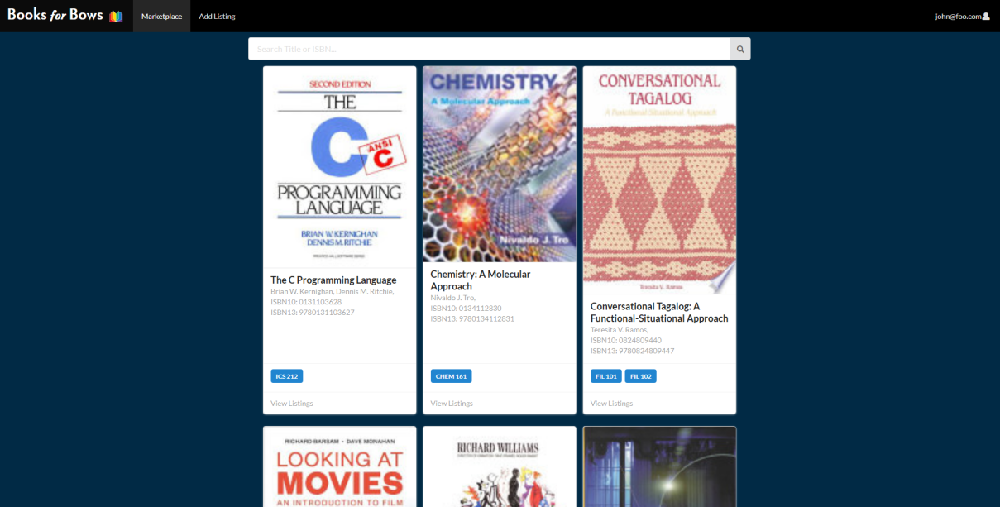
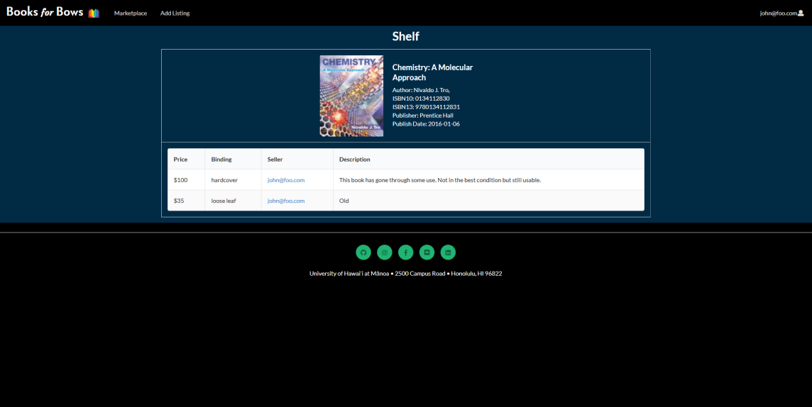

## Project Overview
Books for Bows is a group developed web application that was developed to make the process of finding affordable easier for University of Hawaii at Manoa (UHM) students. To do this, the app focuses on facilitating the buying and selling of textbooks in between students. Its features include users being able to see and search through what textbooks others have put up for sale, as well as list their own books. Users also get additional information such as book previews to make sure the user is creating a listing with the correct book. UHM courses that employ the use of the viewed textbook is also shown.  

For more details on my groups app, please refer to [the Books for Bows github.io page](https://books-for-bows.github.io/).

## My Role
Within the Books for Bows team, my contributions were focused on developing the functionality of the app. For example, a few of the things I worked on include creating a functional search bar and creating React Components that correctly display data from a Mongo Database, as well as manipulate that data. The main pages I worked on were the marketplace page which lists displays all unique listings (on a per book basis) as a card, and the shelf page, which lists all the available listings for the selected book.  

I preferred doing back-end work and other work similar to this rather than creating and implementing design elements. I don't feel like that type of work is suited to my skill set or experience as much as something back-end related. 

*Marketplace Page Example*
*Shelf Page Example*

## What I Learned
Prior to this experience I haven't developed an web-application from the ground up before -- I had only implemented changed to a pre-existing one, so this is a new experience for me. The closest experience I have to this is probably my participation in FIRST Robotics where I also had to develop code in a group environment using Git. Although this similarity is shared between the two, there wasn't nearly as much merge conflicts as I expected there would be. In Robotics, I remember fixing at least one or two conflicts most of the time I decided to merge. Over the course of developing this app, I think I may have had to fix a grand total of about five merge conflicts, which is quite low for what I had anticipated. If I had to accredit this to something, it would be Agile Project Management. If done correctly, I don't think too many merge conflicts would happen because no simultaneous task overlap should happen, eliminating most of the possibility of any conflicts.  

On the topic of Agile Project Management, I don't think my group really followed the process well when it came to meeting weekly and deciding what our next steps were. We did see each other in class and discussed the app over Discord and Slack, but I believe in person meetings would have been more productive. Even when we did discuss the app online, I would always find myself thinking "I forgot to bring up X" later on and feel reluctant in making an overarching design choice without the input of team members. Had the meetings been in person under the circumstance that we're all focused on thinking about the app's progression, I'm sure that holes in the design choices would have been patched up, instead of inconveniently being found out later.  

Looking at the app from start to finish, I feel like my team and I put out a decent product that I wouldn't be ashamed of putting my name on. It's not very shiny or feature packed, but it does most of what we set out to do. It has the core functionalities needed to meet its intended purpose and is simple to use. What's important is it gave me a much needed software development experience. 